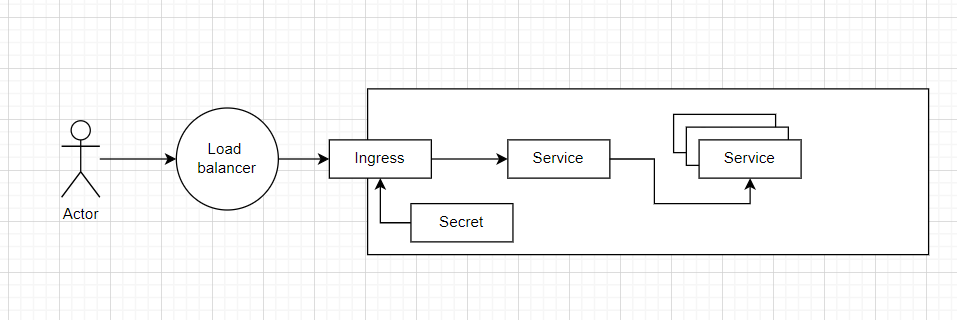

# TLS encryption in a Kubernetes cluster.
This document describes how security can be implemented in a Kubernetes cluster and at which levels.

## Presentation 
Our cluster is exposed thanks to the NSX Advanced Load Balancer (ALB). 

When a client wants to reach an `application`, it will first reach the **ALB**. The ALB will then forward the request to an `ingress controller`, which will route the request to the appropriate `service`.

## Security
### End-to-end encryption (E2EE)
End-to-end encryption is a method of securing data by encrypting it on the originating side and only decrypting it on the destination side, ensuring that the data cannot be read or tampered with by any intermediaries, even if the communication channel itself is compromised.
It can be configured at two different levels: `Load balancer` and `Backend services`.

#### TLS termination at the load balancer level
The ALB can be configured with a certificate to encrypt the traffic between the client and the ALB. 
#### Encryption from Load Balancer to Backend Services
After receiving the traffic, there are two primary ways to handle traffic to the backend services:
- **Unencrypted Traffic (HTTP)**: The load balancer sends the decrypted traffic to the backend services as plain HTTP. This approach may be acceptable within secure, isolated networks but exposes traffic to potential snooping within the network.
- **Re-Encryption (HTTPS)**: The load balancer re-encrypts the traffic before sending it to the backend services. This approach maintains encryption throughout the data's journey, ensuring that the data is encrypted "end-to-end" from the client to the backend service.
*This is the approach we are using in our cluster.*

#### Scenarios
To achieve true `end-to-end encryption` in our scenario (from the client all the way to your application servers), we can concider the following:

- **SSL Offloading:** In this scenario, TLS/SSL is terminated at the load balancer. The NSX Advanced Load Balancer handles the decryption of incoming encrypted traffic. After decryption, the load balancer forwards the traffic as plain HTTP to the backend servers. This approach is beneficial for performance as it offloads the cryptographic operations from the backend servers but does not maintain encryption in transit to the backend.

- **SSL Passthrough:**  Here, the load balancer does not decrypt the TLS/SSL traffic; instead, it simply forwards the encrypted data directly to the backend servers. The decryption happens at the backend. This setup ensures that the data remains encrypted across the network until it reaches the backend server, maintaining a higher level of security.

- **End-to-End Encryption with Re-Encryption:**  In this setup, the NSX Advanced Load Balancer terminates the initial TLS/SSL connection from the client, decrypting the traffic, and then re-encrypts it before forwarding to the backend servers. This method provides a balance between utilizing the load balancer's features (like traffic inspection and application of security policies) and maintaining secure transmission to the backend servers.

### Mutual TLS
There is a third layer of tls security (besides the load balancer and the backend services) that can be implemented: **Mutual TLS**.
Mutual TLS (mTLS) is a security protocol that requires both parties to authenticate each other before establishing a secure connection. It is a two-way authentication process that uses client-side and server-side certificates to authenticate the parties involved in the communication.

In a Kubernetes cluster, mTLS can be implemented by using a service mesh like Istio or Linkerd. These service meshes provide a way to manage mTLS at the network level, ensuring that all communication between services is encrypted and authenticated. 
*This is not implemented in our cluster.*

### Cert-manager
One more thing to concider is how to configure the **backend services** with the certificates.
For the moment, for each application, we have a `secret` that contains the *certificate* and the *key*. This secret is then used in the ingress resource.

We might consider using **cert-manager** to manage the certificates. **Cert-manager** is a Kubernetes add-on to automate the management and issuance of TLS certificates from various issuing sources. It will ensure that the certificates are valid and up-to-date.
All the certificates for all the applications and all the environments will be dealt automatically by **cert-manager**.

